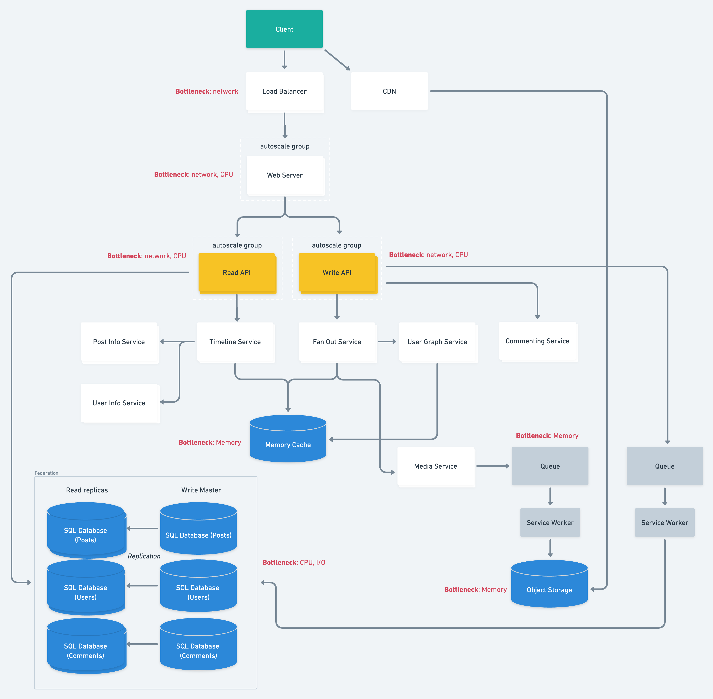

# High Load Applications Architecture

According to Similarweb statistics we have over 6.6 billions of visits per month visiting 11 pages per visit, which equals to 72.6 billions of requests to the **Web server**.

[https://www.similarweb.com/website/instagram.com/#ranking](https://www.similarweb.com/website/instagram.com/#ranking)

## Services:

I decided to split the system to multiple services:

* **Timeline Service** – responsible for the displayed timeline data.
* **Fan Out Service** – responsible for updating followers’ timelines
* **User Graph Service** – responsible for users’ relations
* **Commenting Service** – responsible for commenting feature
* **Post Info Service** – loads post related info (reactions, comments, author id)
* **User Info Service** – loads info about the user
* **Media Service** - responsible for uploading and saving media (images, video)

Read And Write APIs are responsible for Read and Write operations respectfully.

**SPOFs:** At the service level, a SPOF for each service is it’s operability. To avoid such SPOF we need to keep each service within an autoscale group and keep tracking the instances’ health In case of any issues – launch new instances.

## Storage:

We have a read-heavy application so we need to have separate Write Master and Read replicas.

Posts, users data and comments are stored in separate databases

For faster loading, recent posts are stored in Memory Cache. (post_id, author_id)

Media (images, videos) are stored in Object Storage

## Architecture diagram

## Use cases:

### User creates a post:

* **Client** sends new post data to **Web Server**
* The **Web Server** forwards request to the **Write API** server
* **Write API **creates a post record in the **SQL database**
* **Write API** queries **Fan Out Service**, which:
    * **Fan Out Service** contacts **User Graph Service** to get list of user’s followers stored in **Memory Cache**
    * Stores new post in the followers’ timeline (**Memory Cache**)
    * Stores Media (Image, Video) in **Object Storage**

### User views a timeline:

* The **Client** posts a home timeline request to the **Web Server**
* The **Web Server** forwards the request to the** Read API** server
* **Read API **server queries **Timeline Service**, which:
    * Gets a list of user’s followers from the **Memory Cache**
    * Gets a list of recent followers’ posts from **Memory Cache**
    * Queries **Post Info Service** to get additional post data (reactions, comments)
    * Queries **User Info Service** to get info about users who left comments or reactions

### User views other user’s timeline:

* The **Client** posts a home timeline request to the **Web Server**
* The **Web Server** forwards the request to the **Read API** server
* The **Read API** server contacts the **Timeline Service**, which:
    * gets timeline data from the **Memory Cache** (posts ids, followed users ids)
    * queries **Post Info Service** to load post additional info (reactions, comments)
    * queries **User Info Service** to load users’ info

### User comments a post:

* **Client** sends post comment data to **Web Server**
* The **Web Server** forwards request to the **Write API** server
* Write ASPI server queries **Commenting Service**, which:
    * Stores comment in the **SQL database**
    * Queries **Fan Out Service** which:
        * contacts **User Graph Service** to get list of user’s followers stored in **Memory Cache**
        * Updates** **post’s** **comments counter in the followers’ timelines (**Memory Cache**)
        * Updates** **post’s** **comments counter in the author’s timeline (**Memory Cache**)

### User likes a post:

* **Client** sends post comment data to **Web Server**
* The **Web Server** forwards request to the **Write API** server
* Write ASPI server queries  **Fan Out Service**, which:
    * contacts **User Graph Service** to get list of user’s followers stored in **Memory Cache**
    * Updates** **post’s** **likes counter in the followers’ timelines (Memory Cache)
    * Updates** **post’s** **likes counter in the author’s timeline (Memory Cache) 
